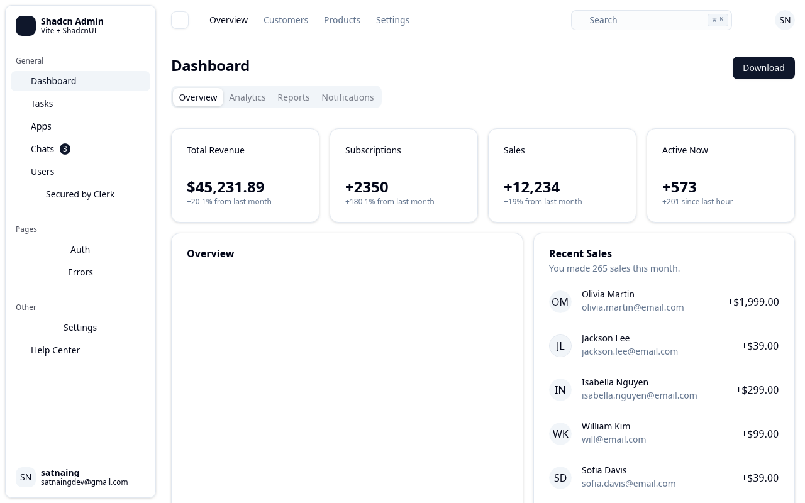
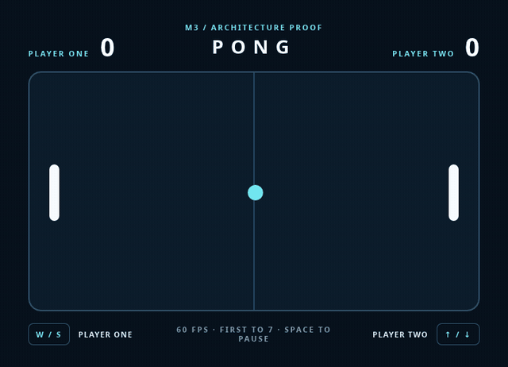

# Blitsen

> Write an app in HTML, CSS and TypeScript. Ship a native executable. No browser included.

Blitsen is an experimental native runtime for applications built from static HTML, CSS and
JavaScript output. It combines JavaScriptCore with [Blitz](https://github.com/DioxusLabs/blitz)'s
native HTML/CSS renderer. It does not embed Chromium, and it does not use the operating system's
WebView.

**The project is pre-alpha.** Linux x64 is the only supported target; Windows and macOS validation
is deferred.

## What it is not

**Blitsen is not a browser and does not aspire to be one.** It is a native application runtime that
happens to use the web platform as its UI model. Three consequences, none of them accidental:

- **Blitsen will render less of the web than a browser does.** That is the trade: you get a renderer
  you ship and control, at a size that is not absurd, and you lose specification coverage. An
  application targeting Blitsen is authored against Blitsen, not ported blind from the web. The
  boundary is published as [capability tiers](docs/COMPATIBILITY.md), generated from the runtime
  itself rather than hand-maintained, and `blitsen doctor` reports what a bundle uses that the
  runtime lacks before you hit it at runtime.
- **There is no sandbox by default.** An application is trusted native software, not an untrusted
  document. No same-origin policy, no permission prompts.
- **It is not for rendering arbitrary third-party web content.** Use a browser engine for that.

An unimplemented API is *absent* — the property does not exist — so feature detection works. Never
a stub that resolves to nothing, never a silent no-op. That is enforced rather than reviewed: the
API manifest is parsed out of the runtime source, and a test asserts every API the manifest calls
absent is genuinely `undefined` against a real bridge context.

## Where it is

**Rendering real applications.** Six applications written by other people — a React admin dashboard
using Tailwind 4, Radix, TanStack and Recharts; a Vue 3 app with vue-router and Pinia; a Svelte
game; and the three stock `create-vite` templates — all render from their own unmodified
`vite build` output. Five export with nothing but a dev dependency and a script line. All six
failed when first measured. See the [M3b evidence](docs/M3B.md).

*[Shadcn Admin](https://github.com/satnaing/shadcn-admin) (MIT), unmodified, rendered without a
browser engine. The empty chart panel is Recharts SVG —
[tracked upstream](https://github.com/DioxusLabs/blitz/issues/448).*

**The architecture proof.** [`examples/pong`](examples/pong) is a two-player Pong app that is
nothing but `index.html`, `style.css` and `game.js`, and runs from a single exported executable on a
machine with no toolchain installed. Frame cost is 0.809 ms median against a 16.7 ms budget, and the
windowed export sustains 60 fps. See the [M3 acceptance evidence](docs/M3.md).

*Every frame is HTML and CSS laid out by Blitz and mutated from JavaScript — the paddles, the ball
and the scoreboard are ordinary DOM nodes. The recording comes from the same harness the acceptance
gate asserts on, so it cannot drift from what the tests verify.*

Input, animation and restyle are proven together by [`examples/interactive`](examples/interactive),
whose gate drives the document through the same coordinate hit test the native window uses
([M2 evidence](docs/M2.md)). Phase 2 — replacing Bun with an embedded JavaScriptCore host — is
underway; the [acquisition decision](docs/JSC.md) pins Bun's WebKit lineage while keeping the
production engine dynamically replaceable behind Blitsen's own ABI.

## Size

Every size figure in this project comes from a measured build, never an estimate. The tracked
baseline lives in
[`packages/blitsen/test/metrics/size-baseline.json`](packages/blitsen/test/metrics/size-baseline.json)
and CI fails on growth beyond 2%. The Phase 1 export carries the whole Bun runtime, which is most of
it; Phase 2 is where that changes. The original 25–50 MB target was withdrawn when the
[M0 measurement](docs/M0.md) showed it was unreachable — it is not quietly still being claimed.

Phase 1 exports are architecture proofs and are **not yet cleared for redistribution**: the
automated third-party notice and JSC relinking gate in [LICENSING.md](docs/LICENSING.md) is not
implemented.

## Documentation

[Product specification](docs/PRODUCT.md) · [Technical specification](docs/TECH.md) ·
[Compatibility profile](docs/COMPATIBILITY.md) · [Licensing](docs/LICENSING.md) ·
[Known Blitz gaps](docs/BLITZ-GAPS.md) · [M0 decision](docs/M0.md)

## Attribution

Blitsen is an independent project built on Blitz. **It is not an official DioxusLabs project and is
not endorsed by DioxusLabs** — the name's proximity to Blitz reflects what it is built on, nothing
more. Rendering gaps found here are [reported upstream](docs/BLITZ-GAPS.md) with reproductions.

## Licence

Blitsen source is dual-licensed under Apache-2.0 or MIT. Exported applications also contain
third-party components with their own terms. In particular, JavaScriptCore includes LGPL-family
code: closed-source applications are supported, but exporters must preserve notices and source
offers, and a recipient's ability to replace or relink JSC. Read
[docs/LICENSING.md](docs/LICENSING.md) before distributing an application.
