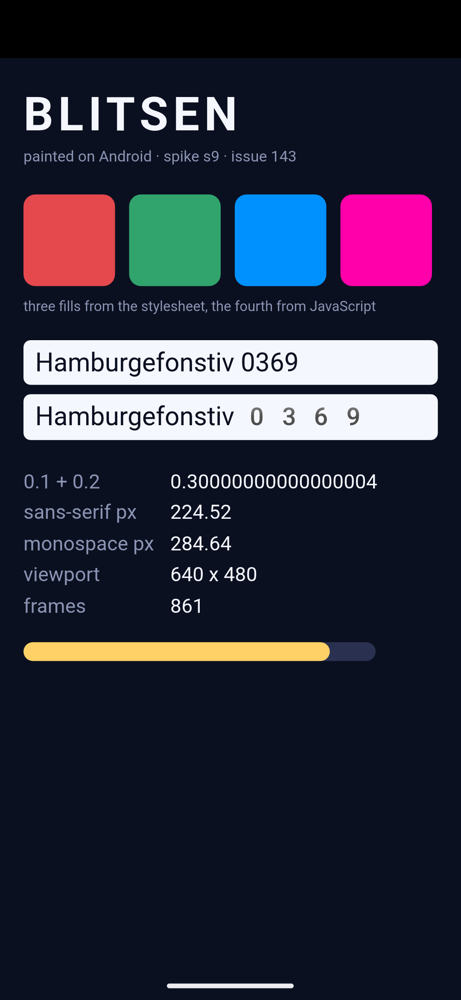
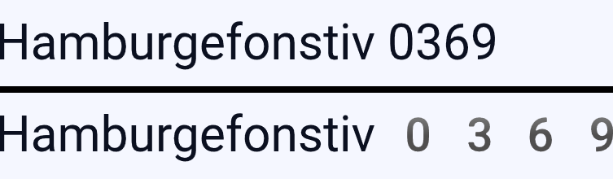

# S9 — Blitsen on Android

Status: **concluded**. Blitsen paints its own document on Android. The frame is
[`results/frame.png`](results/frame.png), it was captured with
`adb exec-out screencap`, and every claim below about what is in it is a count of
pixels of an exact RGB rather than an impression of a picture.



## Question

Everything underneath was already measured. #139 ran *Blitz's* `counter` example
on an emulator and got a correct frame, so the toolchain, the renderer, fonts and
the dependency graph were known-good — for Blitz. #142 landed `blitsen-android`,
a cdylib exporting `android_main`, and #144 landed `ApkAssets`, which reads the
application out of an APK through `AAssetManager`. Both closed with the same
sentence: **it type-checks, it has never been linked and never run.**

So the question is not whether any of the pieces work. It is whether they come up
*together* in one process — the entry point, the assets, the event loop, the wgpu
surface, the platform's fonts and the JavaScript engine — because that
combination has never existed. A window that opens and stays blank would satisfy
every check any of those issues could make, and would be a failure.

## Result

**Yes, and the frame is the document, not a colour.**

| stage | evidence |
| --- | --- |
| links | `libblitsen_android.so`, 39,415,872 B for `x86_64-linux-android`, 35,146,072 B for `aarch64-linux-android`. The first time either has been produced |
| packages | a 39,432,985 B signed APK: `aapt2 link` on one manifest, `zip -0`, `zipalign -p 4`, `apksigner` |
| installs | `adb install -r` → `Success` |
| launches | `Displayed dev.blitsen.s9/android.app.NativeActivity: +452ms` |
| finds its files | `I/Blitsen: starting ApkAssets { root: "blitsen", indexed: true, files: 4 }` — #142's line, doing exactly the job it was added for |
| opens a surface | `libEGL`, `goldfish_vulkan`, `eglCreateContext`, and then pixels |
| resolves fonts | 23,709 px of glyph in the body text, and two type specimens with ink in them |
| runs JavaScript | 45,088 px of `#ff00aa`, a colour that appears in no markup and no stylesheet |
| keeps running | the counter in the document reads 861 in the first capture and 1173 in one taken five seconds later |

Cold start to the first frame is **452 ms** on a headless API-33 emulator with
`-gpu host` (448–579 ms over five runs).

### How the frame was checked

`check.py` counts pixels of exact colours. The document is written so that each
layer of the stack owns one colour that nothing else can produce:

```
frame.png: 1080x2340, 399 distinct colours
  #0b1020  1906830 px  75.45%   the stylesheet's page background
  #f5f7ff   206808 px   8.18%   body text, and the two specimen strips
  #000000   146880 px   5.81%   not ours — see "the surface is inset" below
  #30a46c    45088 px   1.78%   a fill from style.css
  #ff00aa    45088 px   1.78%   a fill from app.js and nowhere else
  #e5484d    45086 px   1.78%   a fill from style.css
  #0091ff    45086 px   1.78%   a fill from style.css
  #ffd166    30407 px   1.20%   a bar app.js resizes on every animation frame
```

Twelve checks, all passing, in [`results/frame.json`](results/frame.json). The
two that carry the most weight:

- **`#ff00aa`, 45,088 px.** `index.html` gives the fourth swatch no colour and
  `style.css` gives it `#3d4463`. `app.js` sets `rgb(255, 0, 170)` on it. That
  colour being on the screen means QuickJS ran, `getElementById` found a node,
  a style mutation crossed the DOM bridge, and layout and paint picked it up.
- **The document contains the layout's own numbers.** `app.js` writes
  `getBoundingClientRect().width` for both specimens into the table, and the
  frame shows `224.52` and `284.64` CSS px. Multiplied by the 2.75 scale factor
  those are 617 and 783 device px; the ink measured in the captured frame spans
  608 and 753 px. Text was measured, and then the measurement was painted.

`(0.1 + 0.2).toFixed(17)` reads `0.30000000000000004` in the frame, which is a
real IEEE 754 double and not a stub returning a string.

### The controls

Four, each breaking one thing. Without them, "painted our document" and "painted
something" are the same picture.

| control | what changes | result |
| --- | --- | --- |
| `--control background` | two literals: the page background and the JavaScript fill | `#3b0b52` 1,894,538 px and `#00ffd0` 45,088 px; `#ff00aa` falls to **0** and `#0b1020` to 11,983 px, all of which is specimen text. Judged against the original document's colours the same frame scores 10/12, and the original frame judged against the control's scores 10/12 |
| `--control no-entrypoint` | `index.html` removed, nothing else | `E/Blitsen: this package has no index.html under assets/blitsen: an application needs an HTML entrypoint`, the Activity finishes, and the capture is the launcher. The index also self-corrects: `files: 3` |
| `--control config-declared` | a dark-mode configuration change under the running app | survives; 12/12, still painting |
| `--control config-undeclared` | the same, with `configChanges` removed from the manifest | **never paints again** (see below) |

The background control is the decisive one, and it is run in both directions: the
control frame fails the original document's checks and the original frame fails
the control's. A checker that passed both would be measuring nothing.

## What this found that was not known

### `window.innerWidth` describes a window that does not exist

The document prints `window.innerWidth + ' x ' + window.innerHeight`, and
`blitsen.runtime.json` in this application says `640 x 480` — a size deliberately
unlike anything on the device.

**The frame shows `640 x 480`.** The surface is neither: `dumpsys window` says
`Requested w=1080 h=2204`. And the layout used the real one — the swatch row
measures 957 device px across, which is the 348 CSS px it should be at a 392.7
CSS px viewport, not at a 640 px one.

So on Android the layout viewport and the JavaScript viewport disagree. winit
ignores the requested surface size there (#147 read this out of the source:
`request_surface_size` returns the current size), no resize follows, and
`Viewport::sync` is left holding the number the export recorded. Every media
query and every `innerWidth` read in an application would be wrong, silently.
This is §7's present-and-subtly-wrong, and it is a lifecycle question: #146.

### A configuration change the manifest does not claim stops the painting for good

#142 documented a hazard and predicted a specific failure: `set_android_app` is
an upstream `OnceLock::set(..).unwrap()`, so a re-entered `android_main` panics.

**That is not what happens.** In every run here — including both configuration
controls — `android-activity` logs `Creating: Activity` exactly once and
`I/Blitsen: starting ApkAssets` exactly once, and there is no panic anywhere in
any log. `android_main` was never re-entered, so the `OnceLock` was never set
twice. The hazard is **untested, not disproved**; nothing here reached it.

What was found instead is worse to diagnose, because it is silent:

```
control-config-declared     3333 px differ between two captures 5 s apart
control-config-undeclared      0 px differ
```

One variable between them — the `android:configChanges` attribute — the same
`.so`, the same document, the same provocation (`adb shell cmd uimode night yes`).
With the attribute, the application absorbs the change and goes on painting. Without
it, the last frame stays on the screen, the process stays alive, and nothing is
ever drawn again. Minutes later the capture was still identical to the byte.
`WindowManager` says what it saw:

```
W/WindowManager: Force clearing freeze: ActivityRecord{… dev.blitsen.s9/android.app.NativeActivity}
I/WindowManager: Screen frozen for +2s35ms due to ActivityRecord{… dev.blitsen.s9/…}
W/WindowManager: Force clearing orientation change: Window{… dev.blitsen.s9/…}
```

— it waited for a redraw that never came. There is no crash, no tombstone and no
logcat line from us, which is the diagnostic problem: a user sees an application
that has stopped, and an APK has no stderr. This is #146's, and it is a larger
piece of it than the panic that was expected.

The manifest here declares `configChanges` for fourteen changes, which is what
every winit-and-`android-activity` recipe does and what `cargo apk` generates a
list of, so an artifact built the ordinary way is armoured against the common
ones. That is a mitigation and not a fix: it cannot cover a change the list does
not name, and #146 has to decide whether Blitsen holds the loop across a real
Activity recreation or refuses one.

### `monospace` is not a monospaced face here

The two specimens measure differently — 608 px of ink against 753 px — which is
what the check asserts and all it asserts. Looking at the glyphs says something
narrower than "two fonts were resolved":



The letters are not merely similar, they are the *same rasterisation*: aligned to
the baseline, the leading two thirds of the two specimens are **100.0%
pixel-identical**, byte for byte, in every run. Only the digits come from a
monospaced face — wider, lighter, and on a fixed advance. So on this system image
`monospace` resolved per glyph: the Latin letters fell back to the face that
answered `sans-serif`, and the whole of the 608 px against 753 px difference is
four digits.

This is font fallback working, not failing, and it is the platform's font
configuration rather than anything of ours. It is recorded because "two families
gave different metrics" is a weaker statement than it looks, and a layout parity
corpus that ever runs on Android will meet it.

### The surface is inset, and the inset is not ours

`#000000` is 5.81% of the frame — a 1080×136 band at the top, and the one large
region of the capture that is not the document. `dumpsys window` explains it:
`mAppBounds=Rect(0, 136 - 1080, 2274)`, so the surface begins below the status
bar and the band above it is not ours to paint. Nothing is clipped and nothing is
wrong with the frame.

What is missing is any way for an application to know. `env(safe-area-inset-*)`
appears nowhere in this repository, so a document that wants to keep its own
content out from under a cutout has nothing to ask. It costs nothing here because
this document's top margin happens to be generous. Out of scope for this issue,
and nobody's yet.

### `libclang` is a link-time requirement, not just a check-time one

#142 landed `rquickjs-sys` `features = ["bindgen"]` for Android and noted the
cost. Confirmed against a real link: `LIBCLANG_PATH=/usr/lib/llvm-18/lib` is
needed, `libclang` 18 is sufficient, and the generated bindings link. #148 and
#149 own provisioning it.

## What this does and does not settle

Settled, and each measured rather than reasoned:

- The four crates that had never been in the same artifact — `blitsen-android`,
  `blitsen-runtime`, `blitsen-host`, `blitsen-quickjs` — link into one `.so` and
  run as one process.
- `ApkAssets` reads a real APK. #144 proved it against a directory stand-in;
  this is `AAssetManager` for real, including the index it writes, and including
  the entrypoint error when the file is not there.
- QuickJS runs, the DOM bridge carries mutations, `getBoundingClientRect`
  returns real numbers, and `requestAnimationFrame` sustains ~60 Hz.
- Vello paints correctly through wgpu on the emulator's Vulkan, which agrees
  with #139's `-gpu host` row.
- Both ABIs link. Only `x86_64` has been run.

Not settled, and deliberately:

- **`-gpu host` is an RTX 3090 behind passthrough.** #139's caveat is unchanged
  and this spike adds nothing to it: Vello on Adreno or Mali is still unanswered
  and only a physical device answers it. `-gpu swiftshader_indirect` was not
  retried, because #139 measured that it kills the emulator and there was no
  question here that needed asking again.
- **The application is four files and no bundler.** No module scripts, no
  `import`, no network, no `native:` calls, no `<canvas>`. Only the ordinary path
  is exercised.
- **`arm64-v8a` has been linked and not run.** No arm64 device or emulator image
  was involved.
- **Touch does nothing**, as the issue scoped. The frame was never touched.
- **Nothing was measured about power, thermals or memory**, and the emulator is
  the wrong place to.

## Reproduce

An emulator must be up **with `-gpu host`** — #139 measured that
`-gpu swiftshader_indirect` reproducibly kills the emulator the moment wgpu
initialises, and that is the emulator's Vulkan rather than anything of ours:

```sh
emulator -avd blitsen33gpu -port 5556 -no-window -no-audio -no-snapshot -gpu host -no-boot-anim &
```

Then, from this directory:

```sh
./run.sh                              # the document
./run.sh --control background         # two colours moved
./run.sh --control no-entrypoint      # index.html left out
./run.sh --control config-declared    # a configuration change the manifest claims
./run.sh --control config-undeclared  # the same, with the claim removed
```

`run.sh` needs `cargo-ndk`, an NDK (r27c here), Android build-tools 34, `adb`,
`python3` with Pillow and NumPy, and `libclang`. It writes each capture, its
logcat excerpt and its measurements into [`results/`](results/); the numbers this
README quotes are in
[`results/x86_64-android.tsv`](results/x86_64-android.tsv).

Nothing here is in the workspace — the root `Cargo.toml` carries
`exclude = ["spikes/*"]` — and the only product code involved is built by the
ordinary `cargo ndk … -p blitsen-android`. `cargo check --workspace` and
`packages/blitsen`'s `bun test` were re-run after this landed and are unchanged.

### What is scaffolding

Everything under `apk/` and `app/`, and the hand-written `blitsen.assets.json`.
The manifest is one activity and no Java, and the packaging is four command-line
tools rather than Gradle. That is the right amount of machinery for a spike and
the wrong amount for a product; **#148 owns the real one**, and this is the shape
of what it has to produce:

- `lib/<abi>/libblitsen_android.so` from `-p blitsen-android`
- `assets/blitsen/` holding the application, stored uncompressed
- `assets/blitsen/blitsen.assets.json`, which nothing writes yet (#144's
  outstanding item)
- `android:hasCode="false"`, and `android.app.lib_name` naming `blitsen_android`
- a `configChanges` list, which on the evidence above is not cosmetic

## Recommendation

The question this spike was set — does the loop, the surface, the fonts and
QuickJS come up together on Android — is answered yes, and the amendment #139
asked for can be written with a frame behind it rather than an inference.

The two things worth carrying forward are both #146's, and neither was on its
list: **the JavaScript viewport does not describe the surface**, and **an
unclaimed configuration change stops the painting silently and permanently**.
The second is the more serious, because it has no symptom an application or a
user can act on, and because the mitigation that hides it — a long
`configChanges` list — is exactly what a packaging step would generate by default
and then nobody would look again.
